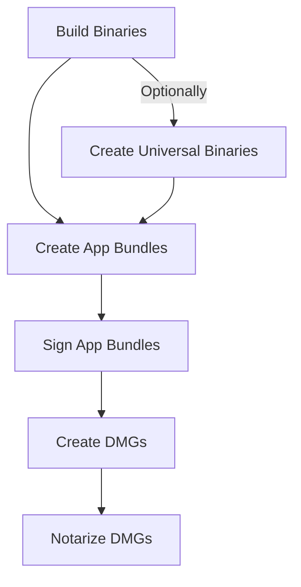

# Notarize macOS applications

GoReleaser can sign & notarize macOS binaries
(and [Universal Binaries][unibin]) using [anchore/quill][quill], and
[App Bundles][appbundles] inside [DMGs][DMG] on native macOS.

To use these features, you'll need:

- An [Apple Developer Account](https://developer.apple.com/) ($99/year).
- A [certificate](https://developer.apple.com/account/resources/certificates/add)
  from said account. It should be of "Developer ID Application" type.
  This will give you a `.cer` file. You'll need to import it into
  `KeyChain.app`, and then export it as a `.p12` file. It'll will have a
  password.
- An App Store Connect
  [API key](https://appstoreconnect.apple.com/access/integrations/api/new).
  This will give you a `.p8` file.

So you should end up with:

1. a `Certificates.p12` file and the password to open it
1. a `ApiKey_AAABBBCCC.p8` file

## Binaries

If you only want to sign and notarize your binaries, this is probably the best
alternative.

It has no external dependencies, and works on any operating system.

!!! warning

    Do not use this method if you create [App Bundles][appbundles].
    App Bundles in which only the binary is signed/notarized are deemed damaged
    by macOS.
    In that case, use the native signing and notarizing documented below.

Read the commented configuration excerpt below to learn how to use these files.

```yaml title=".goreleaser.yaml"
notarize:
  macos:
    - # Whether this configuration is enabled or not.
      #
      # Default: false.
      # Templates: allowed.
      enabled: '{{ isEnvSet "MACOS_SIGN_P12" }}'

      # IDs to use to filter the built binaries.
      #
      # Default: the project name.
      ids:
        - build1
        - build2

      # Before notarizing, we need to sign the binary.
      # This block defines the configuration for doing so.
      sign:
        # The .p12 certificate file path or its base64'd contents.
        #
        # Templates: allowed.
        certificate: "{{.Env.MACOS_SIGN_P12}}"

        # The password to be used to open the certificate.
        #
        # Templates: allowed.
        password: "{{.Env.MACOS_SIGN_PASSWORD}}"

        # Allows to set the signature entitlements XML file.
        #
        # Templates: allowed.
        # Since: v2.6.
        entitlements: ./path/to/entitlements.xml

      # Then, we notarize the binaries.
      #
      # Leave this section empty if you only want to sign the binaries. (<!-- md:version-inline v2.1 -->).
      notarize:
        # The issuer ID.
        # Its the UUID you see when creating the App Store Connect key.
        #
        # Templates: allowed.
        issuer_id: "{{.Env.MACOS_NOTARY_ISSUER_ID}}"

        # Key ID.
        # You can see it in the list of App Store Connect Keys.
        # It will also be in the ApiKey filename.
        #
        # Templates: allowed.
        key_id: "{{.Env.MACOS_NOTARY_KEY_ID}}"

        # The .p8 key file path or its base64'd contents.
        #
        # Templates: allowed.
        key: "{{.Env.MACOS_NOTARY_KEY}}"

        # Whether to wait for the notarization to finish.
        # Not recommended, as it could take a really long time.
        wait: true

        # Timeout for the notarization.
        # Beware of the overall `--timeout` time.
        # This only has any effect if `wait` is true.
        #
        # Default: 10m.
        timeout: 20m
```

<!-- md:templates -->

!!! tip "base64"

    To base64 a file, you run this:

    ```bash
    base64 -w0 < ./Certificates.p12
    base64 -w0 < ./ApiKey_AAABBBCCC.p8
    ```

## Application Bundles and DMGs

<!-- md:version v2.8-unreleased -->
<!-- md:pro -->

This method can sign and notarize [App Bundles][appbundles], but it depends on
`xcrun` and `codesign`.

For now, it'll only work if you package your app as a [DMG][DMG], but we might
add more support in future releases.

To use this, you'll need all the steps from before, plus a profile.
You can create the profile with:

```bash
xcrun notarytool store-credentials $MACOS_NOTARY_PROFILE_NAME \
  --key $KEY_PATH \
  --key-id $MACOS_NOTARY_KEY_ID \
  --issuer $MACOS_NOTARY_ISSUER_ID \
  --keychain $KEYCHAIN_PATH
```

See the configuration options below.

```yaml title=".goreleaser.yaml"
notarize:
  macos_native:
    - # Whether this configuration is enabled or not.
      #
      # Default: false.
      # Templates: allowed.
      enabled: "true"

      # IDs to use to filter the built binaries.
      #
      # Default: the project name.
      ids:
        - build1
        - build2

      # Before notarizing, we need to sign the app bundle.
      # This block defines the configuration for doing so.
      sign:
        # The path to the Keychain, if needed.
        #
        # Templates: allowed.
        keychain: "{{ .Env.KEYCHAIN_PATH }}"

        # The identity in Keychain.
        #
        # Templates: allowed.
        identity: "Developer ID Application: Carlos Becker"

        # Options to pass to 'codesign'.
        options: [runtime]

        # Allows to set the signature entitlements XML file.
        #
        # Templates: allowed.
        entitlements: ./path/to/entitlements.xml

      # Then, we notarize the DMGs.
      notarize:
        # Profile name.
        #
        # Templates: allowed.
        profile_name: "{{ .Env.MACOS_NOTARY_PROFILE_NAME }}"

        # Whether to wait for the notarization to finish.
        # Not recommended, as it could take a really long time.
        wait: true
```

The way this works is:



<details>
  <summary>Set up in GitHub Actions</summary>

**This is only needed for native notarization.**

Make sure to read the [official GitHub Guide][gh-guide] as well, but this is how
we are doing it, in case you want to save some time.

You can also take a look at this
[live example](https://github.com/goreleaser/example-notarized-apps).

```yaml
name: goreleaser
# ...

jobs:
  goreleaser:
    runs-on: macos-latest # only on macos
    env:
      # The base64 of the contents of your '.p12' key.
      MACOS_SIGN_P12: ${{ secrets.MACOS_SIGN_P12 }}

      # The password to open the '.p12' key.
      MACOS_SIGN_PASSWORD: ${{ secrets.MACOS_SIGN_PASSWORD }}

      # A password for our temporary keychain
      KEYCHAIN_PASSWORD: ${{ secrets.KEYCHAIN_PASSWORD }}

      # The profile name to create and use for notarization.
      MACOS_NOTARY_PROFILE_NAME: ${{ secrets.MACOS_NOTARY_PROFILE_NAME }}

      # The base64 of the contents of your '.p8' key.
      MACOS_NOTARY_KEY: ${{ secrets.MACOS_NOTARY_KEY }}

      # The ID of the '.p8' key.
      # You can find it in the filename, as well as the Apple Developer Portal
      # website.
      MACOS_NOTARY_KEY_ID: ${{ secrets.MACOS_NOTARY_KEY_ID }}

      # The issuer UUID.
      # You can find it in the Apple Developer Portal website.
      MACOS_NOTARY_ISSUER_ID: ${{ secrets.MACOS_NOTARY_ISSUER_ID }}
    steps:
      # ...
      - name: "setup-keychain"
        run: |
          # create variables
          CERTIFICATE_PATH=$RUNNER_TEMP/goreleaser.p12
          KEY_PATH=$RUNNER_TEMP/goreleaser.p8
          KEYCHAIN_PATH=$RUNNER_TEMP/goreleaser.keychain-db

          # import certificate and key from secrets
          echo -n "$MACOS_SIGN_P12" | base64 --decode -o $CERTIFICATE_PATH
          echo -n "$MACOS_NOTARY_KEY" | base64 --decode -o $KEY_PATH

          # create temporary keychain
          security create-keychain -p "$KEYCHAIN_PASSWORD" $KEYCHAIN_PATH
          security set-keychain-settings -lut 21600 $KEYCHAIN_PATH
          security unlock-keychain -p "$KEYCHAIN_PASSWORD" $KEYCHAIN_PATH

          # import certificate to keychain
          security import $CERTIFICATE_PATH -P "$MACOS_SIGN_PASSWORD" -A -t cert -f pkcs12 -k $KEYCHAIN_PATH
          security set-key-partition-list -S apple-tool:,apple: -k "$KEYCHAIN_PASSWORD" $KEYCHAIN_PATH
          security list-keychain -d user -s $KEYCHAIN_PATH

          # create notary profile
          xcrun notarytool store-credentials "$MACOS_NOTARY_PROFILE_NAME" \
            --key "$KEY_PATH" \
            --key-id "$MACOS_NOTARY_KEY_ID" \
            --issuer "$MACOS_NOTARY_ISSUER_ID" \
            --keychain $KEYCHAIN_PATH

          # export the keychain path
          echo "KEYCHAIN_PATH=$KEYCHAIN_PATH" >>$GITHUB_ENV

      # ...

      - uses: goreleaser/goreleaser-action@v6
        with:
          distribution: goreleaser-pro
          version: "~> v2"
          args: release --clean
```

</details>

[unibin]: ./universalbinaries.md
[appbundles]: ./app_bundles.md
[quill]: https://github.com/anchore/quill
[DMG]: ./dmg.md
[gh-guide]: https://docs.github.com/en/actions/use-cases-and-examples/deploying/installing-an-apple-certificate-on-macos-runners-for-xcode-development
